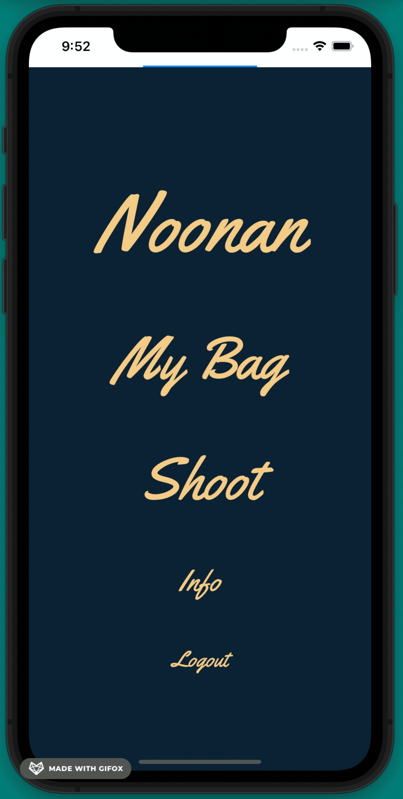
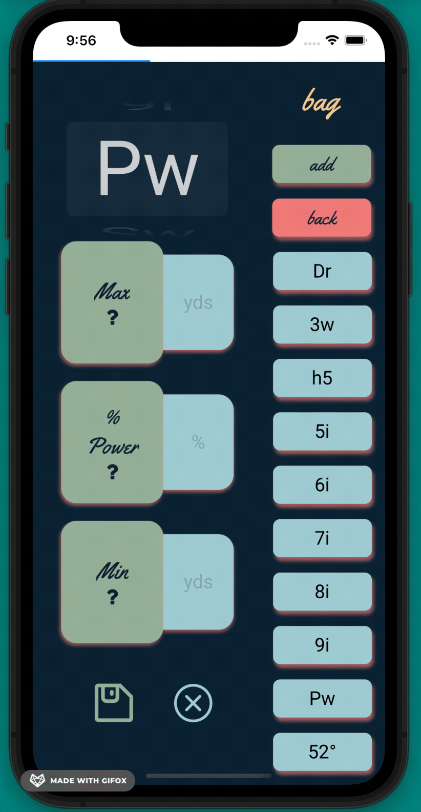
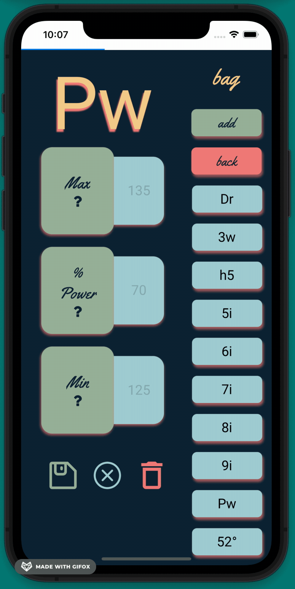
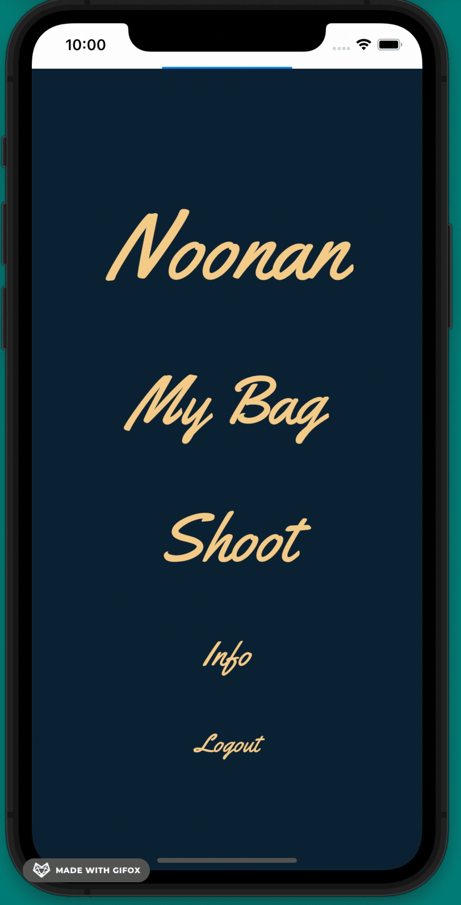
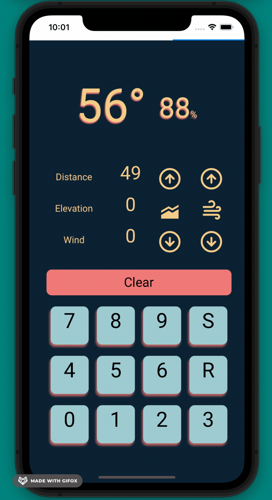

# Noonan

React Native, Javascript, Expo and Firebase.

Noonan is a golf caddy mobile application offering club and shot strength options for an entered distance. These options are calculated behind the scenes by a custom built calculator that factors in a number of inputs, wind, elevation etc. to give the user a best guess at what shot to hit.

These calculations are based upon a “bag” of clubs entered by the user on setup. This provides a unique and tailored output for each user and their skill level.

Noonan is currently being beta and field tested, and will be released in the Apple App Store as well as on Google Play in the near future.

### Bag Screen

### Shot Calculator

